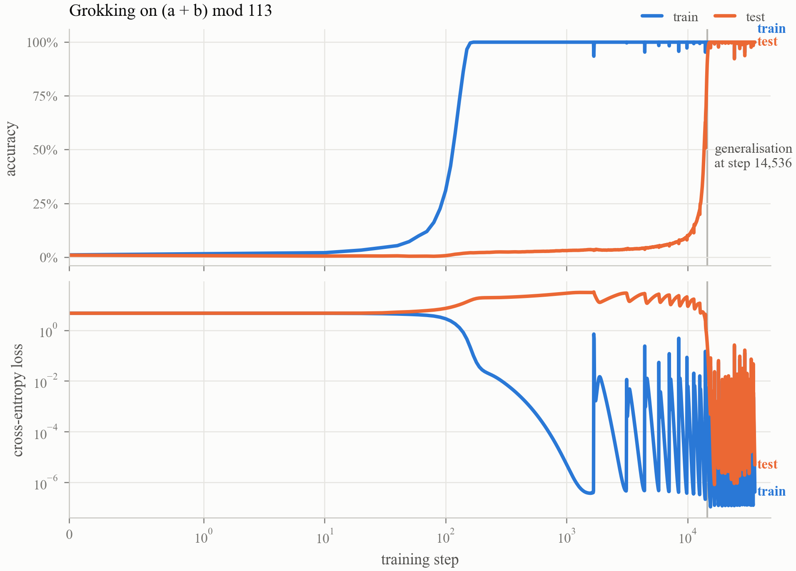
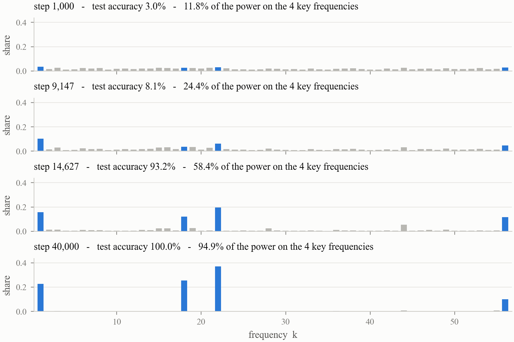
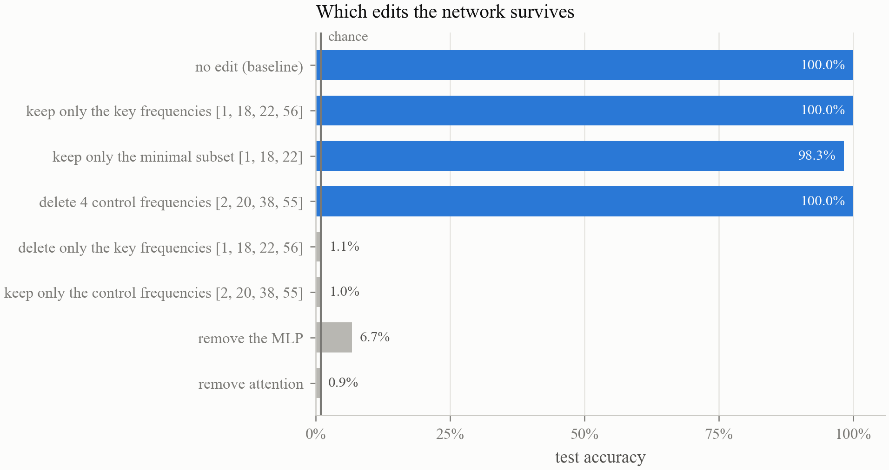
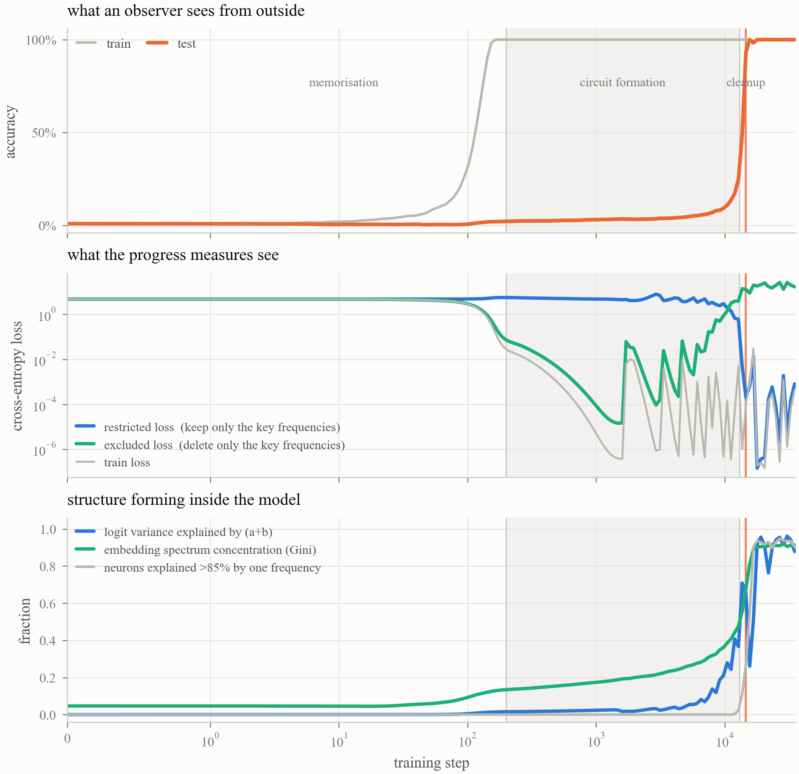
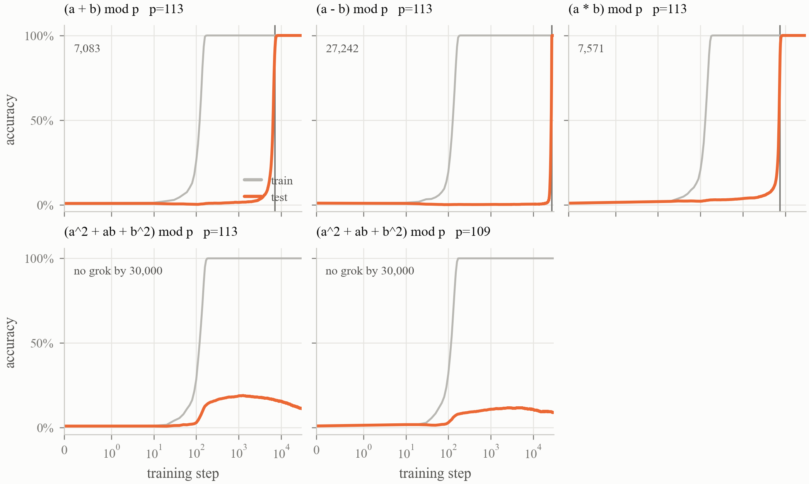
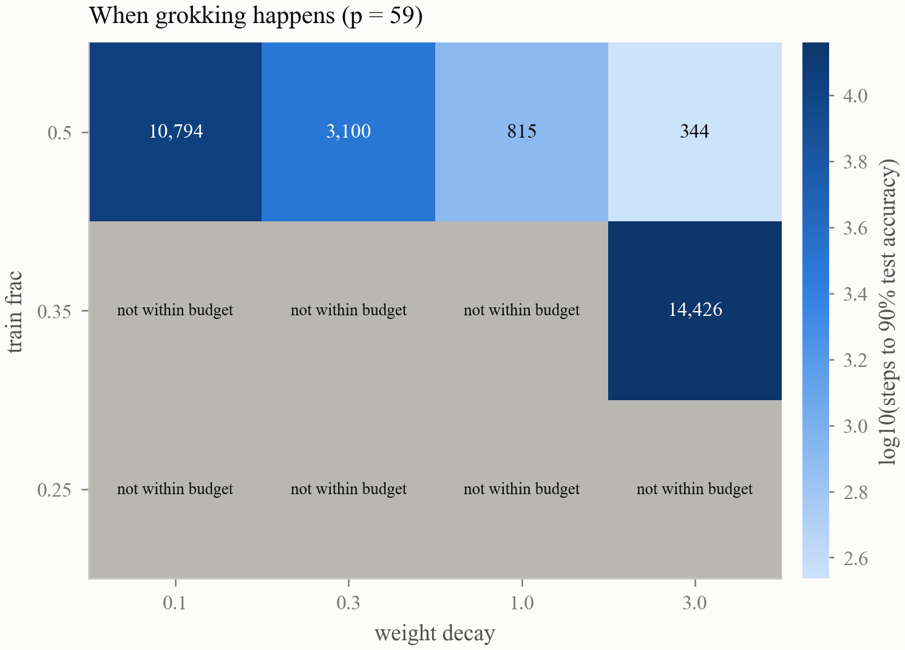

# Grokking, reverse-engineered

A one-layer transformer is trained to compute `(a + b) mod 113` from examples
alone. It memorises its training set within a couple of hundred steps and then
sits at chance on held-out pairs for fourteen thousand more -- the textbook
picture of a failed, overfitted run. If you refuse to stop, it abruptly
generalises.

This repository reproduces that, and then takes the trained network apart to
show what it actually learned: not a lookup table, but a specific algorithm
built out of trigonometry, identified by four methods with no shared machinery,
and confirmed by cutting it out of the weights and watching the model die.

Everything runs on CPU. No data is downloaded -- the dataset is generated
arithmetically. Every number below is read out of a results file by
`scripts/make_report.py`; none is typed by hand.

---

## 0. What the task is

The model is never told the rule. It sees only pairs of symbols and an answer:

```
    (5, 3)   ->   8
  (100, 50)  ->  37          because 150 - 113 = 37
    (7, 9)   ->  16
```

There is nothing in the setup that says these are numbers, that `+` is
addition, or that there is a modulus. As far as the network is concerned there
are 113 arbitrary symbols and a table of answers to fill in.

And it only gets to see part of the table. Shrink the problem to `mod 5` so it
fits on a page -- 25 cells, of which the model is shown 30%:

```
        b=0   b=1   b=2   b=3   b=4
 a=0     0     ?     ?     3     ?
 a=1     ?     2     ?     ?     0
 a=2     2     ?     ?     0     ?
 a=3     ?     ?     0     ?     ?
 a=4     ?     0     ?     ?     3
```

Fill in the question marks. That is the whole task. At `p = 113` it is 3,830
cells shown and 8,939 hidden.

Two completely different strategies both score 100% on the visible cells:

- **Memorise.** With about 226,000 parameters and 3,830 examples there is ample room
  for a lookup table. It fits the training set perfectly and says nothing at all
  about the hidden cells, so test accuracy stays at chance (1/113 = 0.88%).
- **Find the rule.** Then the hidden cells come out right too.

Gradient descent takes the first road, because memorising pays off immediately
while a general circuit pays nothing until it is finished. Grokking is what
happens when you keep training anyway.

---

## 1. The phenomenon

<!-- BEGIN:headline -->
| event | step | note |
|:--|--:|:--|
| training accuracy reaches 99% | 158 | the model has memorised its training set |
| test accuracy reaches 10% | 10,007 | chance is 0.88% |
| test accuracy reaches 50% | 13,705 |  |
| test accuracy reaches 90% | 14,536 | generalisation |
| test accuracy reaches 99% | 14,937 |  |
The model spends **14,379 steps** with perfect training accuracy and near-chance test accuracy. Test loss does not merely stay flat during that stretch -- it *rises*, peaking at **32.74** at step 1,680, as the memorised solution becomes more confident and more wrong.

Setup: `(add) mod 113`, 3,830 of 12,769 pairs used for training (30%), a 226,176-parameter one-layer transformer, full-batch AdamW with weight decay 1.0, 40,000 steps, CPU only.
<!-- END:headline -->



---

## 2. What the network learned

Nothing about the architecture suggests trigonometry. What the analysis finds
is that the trained model represents each input number as a **point on a
circle** and uses the fact that, on a circle, addition is just rotation:

```
    a  ->  ( cos(w*a), sin(w*a) )            w = 2*pi*k/p, for a few values of k

    cos(w*(a+b)) = cos(w*a)cos(w*b) - sin(w*a)sin(w*b)      <- the attention and MLP layers
    sin(w*(a+b)) = sin(w*a)cos(w*b) + cos(w*a)sin(w*b)

    logit(c)  proportional to  sum over k of  cos( w_k * (a + b - c) )
```

The last line is a matched filter. When `c = a + b` every term has phase zero
and they all peak together; for any other `c` the phases disagree and the terms
cancel. Modular wraparound is free: the circle is periodic, so there is no
"subtract 113 if too big" step anywhere in the network.

<!-- BEGIN:mechanism -->
Three rules with independent logic are applied to the final checkpoint (step 40,000). They agree exactly (Jaccard 1.000):

| rule | what it looks at | frequencies found |
|:--|:--|:--|
| embedding-norm threshold | per-index norm of the Fourier-transformed W_E | 1, 18, 22, 56 |
| neuron clustering | which frequency explains >85% of each MLP neuron | 1, 18, 22, 56 |
| power gap (parameter-free) | largest multiplicative gap in sorted per-frequency power | 1, 18, 22, 56 |

Those 4 frequencies carry **94.9%** of the embedding's Fourier power, out of 56 available. The spectrum's Gini coefficient is **0.9124** (published range across settings: 0.55-0.8).

Every one of the 512 MLP neurons is dominated by one of them:

| frequency | neurons assigned |
|:--|--:|
| 22 | 208 |
| 18 | 129 |
| 1 | 102 |
| 56 | 73 |

85.7% of neurons have more than 85% of their variance explained by a single frequency (mean 0.9225, minimum 0.6574).

**What it computes.** Chance for the variance-explained column is 0.0088:

| the logits are a function of... | variance explained |
|:--|--:|
| (a + b) mod p | **0.9626** |
| (a - b) mod p | 0.0064 |
| a alone | 0.0075 |
| b alone | 0.0074 |
| (a * b) mod p | 0.0060 |

**The trigonometric identity.** Within each key frequency, the dependence on (a, b) can be split into the part that is a function of (a+b) and the part that is a function of (a-b). The identity `cos(w(a+b)) = cos(wa)cos(wb) - sin(wa)sin(wb)` predicts that essentially all of it is the former. A calibration run on synthetic logits scores 1.0000 for the exact algorithm and 0.52 for random logits:

| frequency | energy in cos/sin(w(a+b)) | readout is a wave at the same frequency |
|:--|--:|--:|
| 1 | 0.9972 | 0.7820 |
| 18 | 0.9973 | 0.8081 |
| 22 | 0.9935 | 0.8082 |
| 56 | 0.9986 | 0.8185 |
| **mean** | 0.9966 | 0.8042 |
<!-- END:mechanism -->



### The third step, and what the leftover energy is

<!-- BEGIN:readout -->
The mechanism has three steps. Sections above test the first two -- numbers become points on a circle, and the layers combine them with the trigonometric identity. The third is the readout: the amplitudes of cos(w(a+b)) and sin(w(a+b)) have to be *themselves* waves at the same frequency in the answer c, which is what turns the sum into a filter peaked at c = a+b.

Reporting one number for that hides what the remainder is. It splits into named parts: energy at the frequency the algorithm predicts; a constant offset, which is a per-answer logit bias rather than a broken wave; and energy at *another* key frequency, meaning two of the circuits interfere.

| run | configuration | direction read | own frequency | constant offset | cross-talk | left over |
|:--|--:|--:|--:|--:|--:|--:|
| `B_add_s0` | corrected configuration | (a+b) | 0.9980 | 5.85e-07 | 2.06e-04 | 0.0018 |
| `B_add_s1` | corrected, different seed | (a+b) | **0.9990** | 1.56e-07 | 1.29e-04 | 8.38e-04 |
| `C_add_nowarm` | corrected but no warmup | (a+b) | 0.9978 | 1.07e-06 | 4.14e-04 | 0.0018 |
| `C_add_f32` | corrected but float32 loss -- only that | (a+b) | 0.7680 | 0.1237 | 0.0288 | 0.0794 |
| `main_add_s0` | float32 loss, no warmup, dead W_U column | (a+b) | 0.8057 | 0.0984 | 0.0197 | 0.0762 |
| `B_sub_s0` | subtraction, corrected configuration | (a-b) | 0.9903 | 2.83e-07 | 0.0015 | 0.0082 |

**In every clean run the third step is essentially exact** -- 0.998 and 0.999 for the two corrected addition runs, and 0.990 for subtraction once it is read in the direction that model actually uses. Reading subtraction in the (a+b) direction instead returns 0.37, which is not a finding about subtraction but about looking in the wrong place; the same signature appears for multiplication in the ordinary basis.

**The exception is instructive.** The two runs with a float32 loss are the two that carry a constant offset -- around a tenth of the readout energy -- and changing only the loss precision reproduces it. Float32 does not slow grokking, which the controlled comparison already showed. What it does is stop the cleanup: once the training loss reaches the float32 floor at 1.2e-7 the gradient that would have removed the leftover bias is gone, so the bias survives into the final model. The model still reaches 100% accuracy; its internal structure is simply measurably less clean.
<!-- END:readout -->

---

## 3. Causal tests

Sections 2's evidence is correlational: the weights *look like* the algorithm.
That is not the same as the network *using* it -- a component can be beautifully
structured and still be irrelevant to the output. These interventions close the
gap.

<!-- BEGIN:ablations -->
These edit the **weights** and re-run the network, so the intervention propagates the way a real change would. Chance accuracy is 0.0088.

**Embedding surgery.** The control rows matter: deleting any 4 of 56 frequencies removes some of the embedding's norm, so the key-frequency result is only interesting if the control is unharmed.

| edit applied to W_E | train acc | test acc | test loss |
|:--|--:|--:|--:|
| none (baseline) | 1.0 | 1.0 | 6.18e-06 |
| keep ONLY the key frequencies [1, 18, 22, 56] | 1.0 | 0.9998 | 0.0020 |
| delete ONLY the key frequencies [1, 18, 22, 56] | 0.0097 | 0.0105 | 9.8109 |
| delete 4 control frequencies [2, 20, 38, 55] | 1.0 | 1.0 | 2.81e-05 |
| keep ONLY the control frequencies [2, 20, 38, 55] | 0.0123 | 0.0103 | 9.4146 |

**Neuron surgery.**

| MLP neurons mean-ablated | train acc | test acc | test loss |
|:--|--:|--:|--:|
| drop freq 1 | 0.0470 | 0.0452 | 65.3032 |
| keep only freq 1 | 0.0084 | 0.0091 | 1030.1667 |
| drop freq 18 | 0.0055 | 0.0036 | 106.7123 |
| keep only freq 18 | 0.0230 | 0.0211 | 51.7608 |
| drop freq 22 | 0.0086 | 0.0089 | 615.3850 |
| keep only freq 22 | 0.0065 | 0.0098 | 1247.5920 |
| drop freq 56 | 0.9603 | 0.9408 | 0.1922 |
| keep only freq 56 | 0.0089 | 0.0092 | 278.1976 |

**Whole components.**

| component removed | train acc | test acc | test loss |
|:--|--:|--:|--:|
| baseline | 1.0 | 1.0 | 6.18e-06 |
| no mlp | 0.0773 | 0.0675 | 4.3367 |
| no head 0 | 0.4676 | 0.4691 | 3.8923 |
| no head 1 | 0.3037 | 0.2797 | 5.8884 |
| no head 2 | 0.2648 | 0.2464 | 7.3799 |
| no head 3 | 0.1721 | 0.1841 | 11.8239 |
| no attention | 0.0091 | 0.0087 | 6.4997 |

**Logit-space restriction.** Keeping 2 directions per key frequency leaves 8 of 12,769 degrees of freedom per output class:

| logit-space edit | split | loss | accuracy |
|:--|:--|--:|--:|
| keep only the key frequencies' (a+b) directions | all pairs | 4.15e-06 | 1.0 |
| keep only the key frequencies' (a+b) directions | train | 3.98e-06 | 1.0 |
| delete exactly those directions | train | 26.5789 | 0.0050 |
<!-- END:ablations -->



### When the rules disagree

<!-- BEGIN:disagreement -->
The three rules agree perfectly on the mainline run, which is the kind of result that invites not looking any further. Across the other runs they do not always, and the disagreements turn out not to be noise.

| run | rules' Jaccard | frequency in dispute | frequency the ablation calls redundant | same one? |
|:--|--:|--:|--:|--:|
| `main_add_s0` | 1.0 | none | 56 | -- |
| `B_add_s0` | 0.8 | 16 | 16 | yes |
| `B_add_s1` | 0.75 | 26 | 26 | yes |
| `B_sub_s0` | 0.75 | 17 | 17 | yes |
| `C_add_f32` | 1.0 | none | 38 | -- |
| `C_add_nowarm` | 1.0 | none | -- | -- |

In 3 of the 3 runs where the rules disagreed, the frequency they disagreed about is exactly the one the subset ablation -- an entirely separate experiment, run on the weights rather than the representation -- identifies as redundant.

That has a mechanical reading. A passenger frequency is present in the embedding, so a rule that measures embedding norm sees it; but it is not doing enough work to have neurons dedicated to it above the variance threshold, so the clustering rule misses it. The subtraction run is the mirror case -- neurons but not norm -- and points at its passenger just the same. With 3 disagreements this is suggestive rather than established, but it is a falsifiable claim: disagreement between the rules predicts which frequency the model could do without.
<!-- END:disagreement -->

### A fourth identification, using no rule at all

<!-- BEGIN:load_bearing -->
The three rules in section 2 all read the model's *representation*. This one reads its *behaviour*, and uses no threshold, no clustering and no gap statistic: delete one frequency's two output directions at a time and measure what it costs. The unablated training loss is 2.95e-07.

| frequency removed | train loss afterwards |
|:--|--:|
| 22  (identified as key) | 11.1375 |
| 18  (identified as key) | 1.2226 |
| 1  (identified as key) | 0.4058 |
| 56  (identified as key) | 0.0060 |
| 44 | 1.24e-05 |
| 47 | 2.50e-06 |

The remaining 52 frequencies have a median cost of 3.14e-07 -- a separation of seven orders of magnitude between the frequencies that carry the computation and the ones that do not.

Taking the top 4 by this measure alone gives [1, 18, 22, 56], which **matches the three rules exactly**, so four methods with no shared machinery agree on the same set.
<!-- END:load_bearing -->

### Is the circuit minimal?

<!-- BEGIN:redundancy -->
The model settles on 4 frequencies, but that is not the same as needing all 4. Here every subset is kept in the embedding while all 52 non-key frequencies are deleted, and the network is re-run. Chance accuracy is 0.0088:

| frequencies kept in W_E | size | test acc | test loss |
|:--|--:|--:|--:|
| nothing | 0 | 0.0087 | 9.0885 |
| [1] | 1 | 0.0176 | 22.2670 |
| [18] | 1 | 0.0255 | 20.5053 |
| [22] | 1 | 0.0528 | 27.4758 |
| [56] | 1 | 0.0192 | 8.5756 |
| [1, 18] | 2 | 0.1187 | 11.8866 |
| [1, 22] | 2 | 0.2117 | 16.8368 |
| [1, 56] | 2 | 0.0188 | 18.3347 |
| [18, 22] | 2 | 0.2660 | 14.0957 |
| [18, 56] | 2 | 0.0252 | 19.1651 |
| [22, 56] | 2 | 0.0528 | 25.8083 |
| [1, 18, 22] | 3 | 0.9825 | 0.0540 |
| [1, 18, 56] | 3 | 0.1460 | 10.3217 |
| [1, 22, 56] | 3 | 0.2852 | 13.9325 |
| [18, 22, 56] | 3 | 0.2765 | 12.8602 |
| [1, 18, 22, 56] | 4 | 0.9998 | 0.0020 |

**The minimal sufficient set has 3 of the 4 frequencies, and it is unique**: [1, 18, 22] reaches 98.25%, while every other subset of the same size stays below 30%. Frequency 56 is therefore a passenger -- removing it costs almost no accuracy.

It is not free, though: dropping it raises the test loss from 0.0020 to 0.0540, a factor of 26. So under weight decay the extra frequency pays for its own norm, which is what a circuit-efficiency account predicts should happen -- a redundant component survives cleanup exactly when the loss it buys outweighs the penalty it costs.
<!-- END:redundancy -->

---

## 4. The transition is not sudden

<!-- BEGIN:phases -->
Each signal is measured against **its own** range, from its value at initialisation to its final value, so the comparison does not depend on units. A positive lead means the internal signal moves first.

| signal | reaches 10% | lead | reaches 50% | lead |
|:--|--:|--:|--:|--:|
| test accuracy (visible from outside) | 10,453 | 0 | 13,711 | 0 |
| restricted loss | 1,788 | 8,665 | 10,172 | **3,539** |
| embedding spectrum Gini | 189 | 10,263 | 12,822 | 889 |
| power in the key frequencies | 71 | 10,382 | 13,954 | -243 |
| logit variance explained by (a+b) | 7,490 | 2,962 | 13,068 | 643 |
| excluded loss | 13,025 | -2,573 | 13,659 | 52 |
| neurons explained >85% by one frequency | 13,515 | -3,062 | 15,345 | -1,634 |

**Read the 50% column, not the 10% one.** Two of these signals start near a floor set by chance -- the Gini coefficient of a random embedding is not zero, and four of fifty-six frequencies hold about 7% of the power by accident -- so 10% of their eventual change is reached during the memorisation phase, when the embedding is changing violently for reasons that have nothing to do with the circuit. Their apparent ten-thousand-step leads are artefacts of that floor. The restricted loss has no such problem: it starts at the loss of a uniform guess and can only fall by finding real structure, and it leads by about 3,500 steps at the halfway mark.

Read together: the circuit's subspace becomes predictive (restricted loss) and the embedding becomes sparse (Gini) thousands of steps before anything is visible from outside, while excluded loss and neuron crystallisation *lag* -- they measure the removal of the memorised solution, which happens last. That is the three-phase account: memorise, then form the circuit under cover of the memorised solution, then clean the memorised solution away.
<!-- END:phases -->



---

## 5. Other operations

<!-- BEGIN:operations -->
Each run uses the identical configuration; only the operation (and, in one pair, the modulus) changes. `(a+b) variance` and `trig fraction` are the two mechanism tests from section 2, so a row that groks with a low trig fraction has found a *different* algorithm, not the same one.

| task | grokking step | final test acc | key freqs | Gini(W_E) | (a+b) variance | trig fraction |
|:--|--:|--:|--:|--:|--:|--:|
| `(a + b) mod p`, p=113  (`B_add_s0`) | 7,083 | 1.0 | 5 | 0.9225 | 0.9874 | 0.8671 |
| `(a - b) mod p`, p=113  (`B_sub_s0`) | 27,242 | 1.0 | 4 | 0.9467 | 9.19e-05 | 0.1231 |
| `(a * b) mod p`, p=113  (`B_mul_s0`) | 7,571 | 1.0 | 56 | 0.0176 | 0.0087 | 0.5031 |
| `(a^2 + ab + b^2) mod p`, p=113  (`B_sqx_p113`) | none by 30,000 | 0.1138 | -- | -- | -- | -- |
| `(a^2 + ab + b^2) mod p`, p=109  (`B_sqx_p109`) | none by 30,000 | 0.0893 | -- | -- | -- | -- |

**Runs that did not grok within budget.**

- `(a^2 + ab + b^2) mod p` at p=113 did not reach 90% test accuracy within its 30,000-step budget. That is a censored observation, not a demonstration that it never would.

- `(a^2 + ab + b^2) mod p` at p=109 did not reach 90% test accuracy within its 30,000-step budget. That is a censored observation, not a demonstration that it never would.
<!-- END:operations -->



### Multiplication, and the discrete logarithm

<!-- BEGIN:dlog -->
The nonzero residues mod p form a cyclic group of order p-1 under multiplication, so re-indexing them by discrete logarithm turns `a * b` into `dlog(a) + dlog(b) mod (p-1)` -- multiplication becomes addition. This reduction is prior art (Doshi et al., arXiv:2406.03495); what is measured here is whether the circuit is load-bearing in that basis, which is a causal question the observational work did not ask.

| basis | key frequencies | Gini(W_E) | power in key freqs | variance explained by the sum |
|:--|--:|--:|--:|--:|
| ordinary (residues 0..p-1) | 56 | 0.0176 | 0.0387 | 0.0087 |
| discrete log (base g=3, n=112) | 3 | 0.9361 | 0.9690 | 0.9740 |

**Causal test in the multiplicative basis:**

| edit | loss | accuracy |
|:--|--:|--:|
| keep only the multiplicative key frequencies | 8.92e-05 | 1.0 |
| delete exactly those | 9.9218 | 0.0088 |

**The absorbing element.** Zero has no multiplicative inverse, so it sits outside the group the character story is about. Whether it gets its own sub-circuit is unclaimed in the literature:

| question | value |
|:--|--:|
| norm of the embedding row for 0 | 0.5056 |
| mean norm of the other rows | 1.0468 |
| that as a z-score | -17.0170 |
| strongest neuron correlation with (a == 0) | 0.0348 |
| strongest neuron correlation with (b == 0) | 0.0351 |

The answer is that it does not. No neuron correlates with `a == 0` above 0.035. Instead the network **shrinks the embedding of 0 until it barely exists** -- norm 0.5056 against 1.0468 for the other rows, the smallest of all 113. With almost nothing added to the residual stream the default output takes over, and the default is the right answer: the model is correct on all 225 pairs involving a zero, and predicts 0 for every one of them.
<!-- END:dlog -->

### Which correction actually mattered?

<!-- BEGIN:controls -->
The first run of this project used float32 cross-entropy, no learning-rate warmup, and an unembedding with a column for the "=" token that can never be correct. Fixing all three at once halved the grokking step, which is the kind of observation that is easy to attribute to the most interesting of the three causes. These runs change one thing at a time.

| run | what differs | grokking step |
|:--|:--|--:|
| `main_add_s0` | float32 loss, no warmup, a dead "=" column in W_U | 14,536 |
| `B_add_s0` | the corrected configuration: float64 loss, 10-step warmup, no dead column | 7,083 |
| `C_add_f32` | as B_add_s0 but the loss back in float32 -- only that | 6,734 |
| `C_add_nowarm` | as B_add_s0 but no warmup -- only that | 9,764 |
| `B_add_s1` | as B_add_s0, different seed for both the split and the weights | 6,228 |

**Float32 was not the cause.** Putting the loss back in float32 and changing nothing else moves the grokking step by -349 (6,734 against 7,083) -- within the seed-to-seed spread below. Removing the warmup costs +2,681. Neither accounts for the gap to the original 14,536, and the remaining difference is the initialisation: dropping the dead W_U column changes the shape of a weight matrix and therefore the whole random draw, so those two runs do not share an initialisation at all. The honest reading is that the original run was a slow draw, not that any correction sped things up.

This is worth stating plainly because the float64 loss *is* the right choice -- in float32 the reported training loss bottoms out at 1.2e-7 and the curve below that is an artefact -- but being right about the measurement is not the same as being the cause of the speedup, and a controlled run is what separates them.
<!-- END:controls -->

---

## 6. When does grokking happen?

<!-- BEGIN:phase_diagram -->
A smaller modulus (p = 59) makes a run cheap enough to sweep. Each cell is one run of 20,000 steps; the number is the step at which test accuracy first reaches 90%.

|  | wd = 0.1 | wd = 0.3 | wd = 1.0 | wd = 3.0 |
|:--|--:|--:|--:|--:|
| train fraction 0.25 | none (max 2%) | none (max 2%) | none (max 2%) | none (max 2%) |
| train fraction 0.35 | none (max 5%) | none (max 6%) | none (max 17%) | 14,426 |
| train fraction 0.5 | 10,794 | 3,100 | 815 | 344 |

**Censoring.** 7 of 12 cells did not reach 90% within 20,000 steps. That is a censored observation -- such a run may grok later -- and is never reported as 'does not grok'.

Averaged over the training fractions that grokked, the step at which generalisation happens **falls** with weight decay: wd 0.1 -> 10,794, wd 0.3 -> 3,100, wd 1.0 -> 815, wd 3.0 -> 7,385. The primary source contradicts itself three ways on the direction of this effect, so this is reported as our own measurement on one seed at one modulus, not as a confirmation of anything.

**Does the mechanism depend on the configuration?**

| configuration | grokking step | key freqs | Gini(W_E) | (a+b) variance | final test acc |
|:--|--:|--:|--:|--:|--:|
| wd 0.1, frac 0.25 | none (max 2%) | 29 | 0.1947 | 0.0155 | 0.0088 |
| wd 0.3, frac 0.25 | none (max 2%) | 29 | 0.2456 | 0.0261 | 0.0088 |
| wd 1.0, frac 0.25 | none (max 2%) | 29 | 0.2985 | 0.0420 | 0.0130 |
| wd 3.0, frac 0.25 | none (max 2%) | 29 | 0.2926 | 0.0459 | 0.0100 |
| wd 0.1, frac 0.35 | none (max 5%) | 29 | 0.2076 | 0.0461 | 0.0455 |
| wd 0.3, frac 0.35 | none (max 6%) | 29 | 0.2701 | 0.0729 | 0.0544 |
| wd 1.0, frac 0.35 | none (max 17%) | 26 | 0.4495 | 0.3618 | 0.1653 |
| wd 3.0, frac 0.35 | 14,426 | 4 | 0.8489 | 0.9804 | 1.0 |
| wd 0.1, frac 0.5 | 10,794 | 8 | 0.7362 | 0.9797 | 1.0 |
| wd 0.3, frac 0.5 | 3,100 | 3 | 0.8909 | 0.9906 | 1.0 |
| wd 1.0, frac 0.5 | 815 | 3 | 0.8922 | 0.9916 | 1.0 |
| wd 3.0, frac 0.5 | 344 | 3 | 0.8919 | 0.9912 | 1.0 |
<!-- END:phase_diagram -->



### Does that survive a change of seed?

<!-- BEGIN:replicates -->
Every cell of the diagram above is a single run, which is the weakest thing about it. This repeats the row where all four cells grokked, with a different seed for both the data split and the initialisation:

|  | seed 0 | seed 1 |
|:--|--:|--:|
| weight decay 0.1 | 10,794 | none by 12,000 |
| weight decay 0.3 | 3,100 | 4,010 |
| weight decay 1.0 | 815 | 922 |
| weight decay 3.0 | 344 | 255 |

The ordering is strictly monotone in both seeds: more weight decay, earlier grokking, at every step of the grid. One seed could have produced that by accident; two making the same ordering is harder to dismiss, though it is still two.
<!-- END:replicates -->

---

## 7. Can the transition be predicted in advance?

<!-- BEGIN:prediction -->
Section 4 shows the progress measures moving before the accuracy does *within one run*. That is a much weaker claim than being able to look at an unseen run at step 1,000 and say what happens at step 10,000. With 21 runs that have a full trajectory (9 of which never reached 90% inside their budget), both questions can at least be asked.

**Measured at step 200** (21 runs):

| signal | AUC: will grok vs will not | rank correlation with the grokking step |
|:--|--:|--:|
| embedding Gini | **0.815** | -0.66 |
| (a+b) variance explained | 0.778 | -0.66 |
| excluded loss | 0.713 | -0.71 |
| test accuracy (the visible one) | 0.676 | -0.69 |
| restricted loss | 0.667 | 0.6 |
| power in key frequencies | 0.593 | -0.65 |
| train loss | 0.306 | 0.22 |
| weight norm | 0.25 | 0.59 |

**Measured at step 500** (21 runs):

| signal | AUC: will grok vs will not | rank correlation with the grokking step |
|:--|--:|--:|
| embedding Gini | **0.833** | -0.68 |
| (a+b) variance explained | 0.815 | -0.68 |
| test accuracy (the visible one) | 0.667 | -0.71 |
| restricted loss | 0.639 | 0.65 |
| power in key frequencies | 0.62 | -0.64 |
| excluded loss | 0.556 | -0.71 |
| weight norm | 0.296 | 0.61 |
| train loss | 0.287 | 0.34 |

**Measured at step 1,000** (21 runs):

| signal | AUC: will grok vs will not | rank correlation with the grokking step |
|:--|--:|--:|
| embedding Gini | 0.843 | -0.68 |
| (a+b) variance explained | **0.843** | -0.68 |
| restricted loss | 0.667 | 0.7 |
| test accuracy (the visible one) | 0.667 | -0.69 |
| power in key frequencies | 0.648 | -0.64 |
| excluded loss | 0.556 | -0.71 |
| weight norm | 0.315 | 0.66 |
| train loss | 0.287 | 0.32 |

**Measured at step 2,000** (21 runs):

| signal | AUC: will grok vs will not | rank correlation with the grokking step |
|:--|--:|--:|
| (a+b) variance explained | **0.833** | -0.66 |
| embedding Gini | 0.824 | -0.68 |
| restricted loss | 0.722 | 0.71 |
| power in key frequencies | 0.676 | -0.64 |
| test accuracy (the visible one) | 0.676 | -0.7 |
| excluded loss | 0.639 | -0.6 |
| weight norm | 0.398 | 0.61 |
| train loss | 0.231 | 0.31 |

AUC is the probability that a run which will grok scores above one that will not, so 0.5 is chance and 1.0 is perfect separation.

**That table is confounded and should not be read as a result.** The runs that never grokked are almost all low-training-fraction sweep cells, and the training fraction is itself what decides whether grokking happens, so any signal that merely tracks it scores well. The clean question has to be asked inside a single configuration.

**Within one configuration.** These 5 runs share the task (`add`), the modulus (p = 113), the training fraction (0.3) and the weight decay (1.0). What differs is the random draw, and the grokking step still spans more than a factor of two:

| run | grokking step |
|:--|--:|
| B_add_s1 | 6,228 |
| C_add_f32 | 6,734 |
| B_add_s0 | 7,083 |
| C_add_nowarm | 9,764 |
| main_add_s0 | 14,536 |

Rank correlation between the signal measured early and the step at which the run eventually generalises. Negative means a higher reading predicts an earlier transition:

| signal | at step 200 | at step 500 | at step 1,000 | at step 2,000 |
|:--|--:|--:|--:|--:|
| restricted loss | 0.6 | 0.6 | 0.7 | 0.9 |
| excluded loss | -0.9 | -1.0 | -1.0 | -0.7 |
| embedding Gini | -0.8 | -0.9 | -0.9 | -0.9 |
| power in key frequencies | -1.0 | -0.9 | -0.9 | -1.0 |
| (a+b) variance explained | -0.9 | -0.9 | -0.9 | -0.7 |
| weight norm | 0.9 | 1.0 | 0.9 | 0.2 |
| train loss | -0.7 | -0.7 | -0.5 | -0.6 |
| test accuracy (the visible one) | -0.3 | -0.4 | -0.1 | -0.3 |

At step 500 -- six to fourteen thousand steps before anything happens -- several internal signals rank these runs almost perfectly, while the one quantity an observer can actually see, the test accuracy, does not rank them at all.

**How much to believe.** n = 5, and 8 signals were checked at 4 time points, so no single coefficient here survives a correction for multiple comparisons. What is worth something is that every internal signal points the same way at every time point while the external one does not. And the deflationary reading deserves equal billing: the plain weight norm does as well as any mechanistic measure, so on this evidence predicting grokking may not require interpretability at all.
<!-- END:prediction -->

---

## Method notes

**The instruments are calibrated.** Every structural metric is run on synthetic
inputs whose answer is known before it is trusted on a real model
(`tests/test_core.py`). On logits built to be exactly
`sum_k cos(w_k (a + b - c))` the "(a+b) variance explained" reads 1.0000 and the
trig fraction reads 1.0000; on random logits they read 0.0088 (= 1/113, chance)
and 0.52. So the numbers in section 2 are interpretable rather than merely
large.

**Key frequencies are derived once, from the final checkpoint, and then held
fixed** across the whole trajectory. That is the point of a progress measure:
the question is when the *final* circuit starts to exist. Re-deriving the set at
each step asks a different question at every step, and at early steps the
spectrum is dense enough that the rules just pick an arbitrary frequency.

**The loss is computed in float64.** In float32, `log_softmax` quantises at
2^-23 = 1.2e-7, so once the model has memorised, the reported training loss
bottoms out at that value and the gradient of the correct class degrades.
Since the entire phenomenon lives in the tens of thousands of steps *after* the
training loss is nominally zero, a loss floor is exactly the wrong artefact to
have. Parameters stay in float32; only the logits are upcast.

**Runs are reproducible in distribution, not bit-exact.** With one thread,
identical seeds give bit-identical weights, and `tests/` asserts it. With more
than one thread they do not: PyTorch's multi-threaded CPU reductions do not fix
their summation order, and two runs of the same code at 6 threads diverge in
the training loss by about 1e-4 within a hundred steps. The mainline runs here
use 5-6 threads for speed, so a re-run will land near these numbers rather than
on them. Grokking time is the quantity most exposed to that, which is one more
reason the seed replicates matter.

**Published numbers are quarantined** in `src/grokking/literature.py`, each with
its reference, and appear only in columns labelled as such. Values that a source
states but that should not be quoted as fact -- a seed-dependent frequency set,
a claim the source contradicts elsewhere -- are listed there too, with the
reason.

---

## Reproducing

```bash
pip install -r requirements.txt
python -m pytest tests/ -q                      # no training needed

python scripts/run_train.py --tag main --op add --steps 40000
python scripts/analyze_run.py --tag main        # walk the trajectory
python scripts/analyze_mechanism.py --tag main  # the final-checkpoint report
python scripts/make_figures.py --tag main
python scripts/make_report.py --tag main        # regenerate every table above
```

<!-- BEGIN:runtime -->
The mainline run is 40,000 steps in **82 minutes** on 6 CPU threads (122 ms per full-batch step). Checkpoints for one run are about 140 MB.
<!-- END:runtime -->

---

## Layout

```
src/grokking/
  data.py          the p*p table, tokenisation, the train/test split
  model.py         a one-layer transformer written out explicitly
  train.py         full-batch training with a hybrid log+dense checkpoint schedule
  fourier.py       real Fourier basis over Z_n, and the discrete-log re-indexing
  literature.py    published values, quarantined, each with its reference
  analysis/
    core.py        load a checkpoint, run the whole input table through it
    spectra.py     spectra of weights and activations; three key-frequency rules
    structure.py   does the output depend only on (a+b)?  is it the trig identity?
    progress.py    restricted and excluded loss
    ablation.py    weight-level causal interventions
    dlog.py        the multiplicative-character view of modular multiplication
    timing.py      locating the transition on a trajectory
  viz/             one place where typography and colour are decided
  report.py        markdown table machinery
  report_blocks.py every number that reaches the README comes through here
scripts/           runnable entry points
  run_pipeline.sh  run job files in sequence, then analyse what they produced
tests/             correctness tests for everything the results depend on
```

---

## Honesty notes

- **Nothing here is a new discovery.** The phenomenon is Power et al. (2022);
  the mechanism and the progress measures are Nanda et al. (2023); the
  discrete-logarithm reduction for multiplication is Doshi et al. (2024). This
  is a from-scratch reproduction plus a few extensions, and the sections say
  which is which.
- **Runs that fail to grok are reported as failures**, with the step budget
  stated in the same sentence, because "did not grok in 30,000 steps" and "does
  not grok" are different claims.
- **The lead times in section 4 are single-run measurements.** Grokking time
  varies substantially: across the five addition runs here it ranges from 6,228
  to 14,536 steps under nominally the same recipe. Two seeds is not a
  distribution, and the "which correction mattered" section exists because the
  first reading of that spread was wrong.
- **One hypothesis in this repository was tested and refuted.** The corrected
  configuration grokked in half the steps of the original, and the obvious
  explanation -- the float64 loss -- turned out to be wrong when run as a
  controlled comparison. It is left in the write-up rather than quietly removed.
- This project was built with AI assistance (Claude). The experimental design,
  the corrections to the implementation, and the write-up were produced
  interactively; every number was produced by running the code in this
  repository on this machine.
